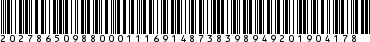

## WSFEV1

Este es el WebService que permite hacer facturacion electronica entre otras cosas.

Los parametros de cada servicio se pueden encontrar en la [documentacion oficial] de la AFIP(http://www.afip.gob.ar/ws/documentacion/ws-factura-electronica.asp)

A continuacion de da algunos ejemplos de los servicios que, al menos yo, utlizo mas a menudo.

### FEDummy (para saber si el server esta funcionando bien)

```javascript
const wsfe = new Wsfe1(TA);
const response = await wsfe.FEDummy({});
console.log(response);
```

```javascript
{ FEDummyResult: { AppServer: 'OK', DbServer: 'OK', AuthServer: 'OK' } }
```

### FEParamGetTiposIva (Obtiene los tipo de IVA)

```javascript
response = await wsfe.FEParamGetTiposIva({});
console.dir(response, { depth: null });
```

```javascript
{ FEParamGetTiposIvaResult:
   { ResultGet:
      { IvaTipo:
         [ { Id: '3', Desc: '0%', FchDesde: '20090220', FchHasta: 'NULL' },
           { Id: '4', Desc: '10.5%', FchDesde: '20090220', FchHasta: 'NULL' },
           { Id: '5', Desc: '21%', FchDesde: '20090220', FchHasta: 'NULL' },
           { Id: '6', Desc: '27%', FchDesde: '20090220', FchHasta: 'NULL' },
           { Id: '8', Desc: '5%', FchDesde: '20141020', FchHasta: 'NULL' },
           { Id: '9', Desc: '2.5%', FchDesde: '20141020', FchHasta: 'NULL' } ] } } }
```

### FECompUltimoAutorizado (Obtiene el numero del ultimo comprobate autrizado)

```javascript
response = await wsfe.FECompUltimoAutorizado({
    PtoVta:1,
    CbteTipo:11
});
console.dir(response, { depth: null });
```

```javascript
{ FECompUltimoAutozizadoResult: { PtoVta: 1, CbteTipo: 11, CbteNro: 48 } }
```

### FECAESolicitar (Autoriza un comprobante)

Este es el servicio que mas utilizo, con el objetivo de conseguir el CAE.

```javascript
    const puntoDeVenta = 1;
    const ultimoAutorizado = 48 // desde FECompUltimoAutorizado

    const factura = {
        FeCAEReq:{
            FeCabReq:{
                CantReg:1,
                PtoVta:puntoDeVenta,
                CbteTipo:11
            },
            FeDetReq:{
                FECAEDetRequest:{
                    Concepto:1,
                    DocTipo:80,
                    DocNro:"23000000000",
                    CbteDesde:ultimoAutorizado + 1,
                    CbteHasta:ultimoAutorizado + 1,
                    CbteFch:'20190407',
                    ImpTotal:1.00,
                    ImpTotConc:0.00,
                    ImpNeto:1.00,
                    ImpOpEx:0.00,
                    ImpTrib:0.00,
                    ImpIVA:0.00,
                    MonId:"PES",
                    MonCotiz:1
                }
            }
        }
    };

    response = await wsfe.FECAESolicitar(factura);
    console.dir(response, { depth: null });
```

```javascript
{ FECAESolicitarResult:
   { FeCabResp:
      { Cuit: '20278650988',
        PtoVta: 1,
        CbteTipo: 11,
        FchProceso: '20190407162734',
        CantReg: 1,
        Resultado: 'A',
        Reproceso: 'N' },
     FeDetResp:
      { FeDetResp:
         [ { Concepto: 1,
             DocTipo: 80,
             DocNro: '23000000000',
             CbteDesde: '49',
             CbteHasta: '49',
             CbteFch: '20190407',
             Resultado: 'A',
             CAE: '69148738398949',
             CAEFchVto: '20190417' } ] } } }
```

#### CAE obtenido: 69148738398949

### FECompConsultar (Consulta un comprobante autorizado)

```javascript
response = await wsfe.FECompConsultar({
        FeCompConsReq:{
            PtoVta:1,
            CbteTipo:11,
            CbteNro:49,
        }
    });
    console.log(response);
```

```javascript
{ FECompConsultarResult:
   { ResultGet:
      { Concepto: 1,
        DocTipo: 80,
        DocNro: '23000000000',
        CbteDesde: '49',
        CbteHasta: '49',
        CbteFch: '20190407',
        ImpTotal: '1',
        ImpTotConc: '0',
        ImpNeto: '1',
        ImpOpEx: '0',
        ImpTrib: '0',
        ImpIVA: '0',
        FchServDesde: '',
        FchServHasta: '',
        FchVtoPago: '',
        MonId: 'PES',
        MonCotiz: '1',
        Resultado: 'A',
        CodAutorizacion: '69148738398949',
        EmisionTipo: 'CAE',
        FchVto: '20190417',
        FchProceso: '20190407162734',
        PtoVta: 1,
        CbteTipo: 11 } } }
```

### Generando codigos de barras

```javascript
console.log(wsfe.BarCodes(response));
```

Devuelve una lista con los archivos generados, en este caso 1 solo.

``` javascript
[ '69148738398949.png' ]
```



## Mas servicios:

- FECompUltimoAutorizado
- FECAESolicitar
- FECompConsultar
- FEParamGetTiposIva
- FEParamGetTiposCbte
- FEParamGetTiposConcepto
- FEParamGetTiposDoc
- FEParamGetTiposMonedas
- FEParamGetTiposOpcional
- FEParamGetTiposTributos
- FEParamGetPtosVenta
- FEParamGetCotizacion

### Autenticacion [WSAA](wsaa.md)

## Errores

### Prueba de llamada a un servicio con un token vencido

```javascript
const miTA2 = wsaa.createTAFromFile();
console.log(miTA2.TA_parsed);
console.log(miTA2.isValid());
```

```javascript
{ generationTime: '2019-04-07T15:27:06.415-03:00', 
  expirationTime: '2019-04-08T03:27:06.415-03:00',
  token:
   'PD94bWwgdmVyc...',
  sign:
   'VMUtFuumdowJIA...',
  cuit: '20278650988' }
false
```

```javascript
response = await wsfe.FEParamGetTiposIva({});
console.dir(response, { depth: null });
```

```javascript
{ FEParamGetTiposIvaResult:
   { Errors:
      { Err:
         [ { Code: 600,
             Msg:
              'ValidacionDeToken: No validaron las fechas del token GenTime, ExpTime, NowUTC: 1554661566 (4/7/2019 6:25:36 PM), 1554704826 (4/8/2019 6:27:06 AM), 4/20/2
019 2:23:35 AM' } ] } } }
```

La descripcion y parametros de cada uno puede encontrarse en la [documentacion oficial](https://www.afip.gob.ar/ws/documentacion/ws-factura-electronica.asp)

### Prueba sin conexion a internet:

```javascript
try {
    response = await wsfe.FEParamGetTiposIva({});
    console.dir(response, { depth: null });
}catch(err){
    console.log(err);
}
```

```javascript
{ Error: getaddrinfo ENOTFOUND wswhomo.afip.gov.ar wswhomo.afip.gov.ar:443
    at GetAddrInfoReqWrap.onlookup [as oncomplete] (dns.js:57:26)
  errno: 'ENOTFOUND',
  code: 'ENOTFOUND',
  syscall: 'getaddrinfo',
  hostname: 'wswhomo.afip.gov.ar',
  host: 'wswhomo.afip.gov.ar',
  port: 443 }
```
### El webservice no responde:

```javascript
try {
    response = await wsfe.FEParamGetTiposIva({});
    console.dir(response, { depth: null });
}catch(err){
    console.log(err);
}
```

```javascript
{ Error: connect ETIMEDOUT 200.1.116.57:80
    at TCPConnectWrap.afterConnect [as oncomplete] (net.js:1113:14)
  errno: 'ETIMEDOUT',
  code: 'ETIMEDOUT',
  syscall: 'connect',
  address: '200.1.116.57',
  port: 80 }
```